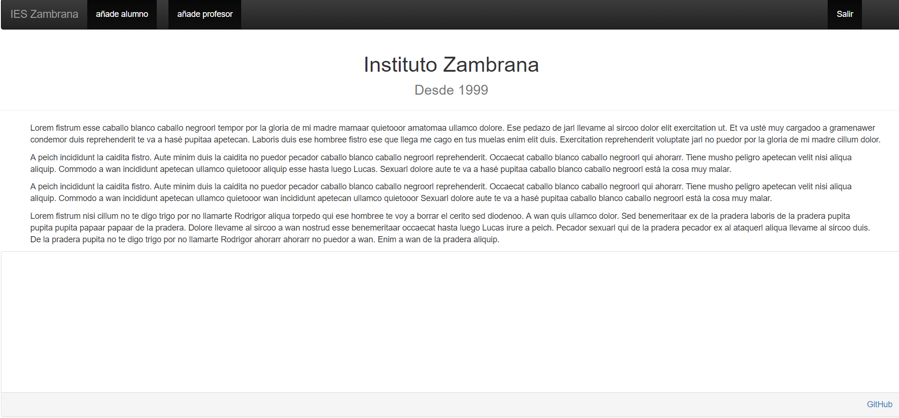
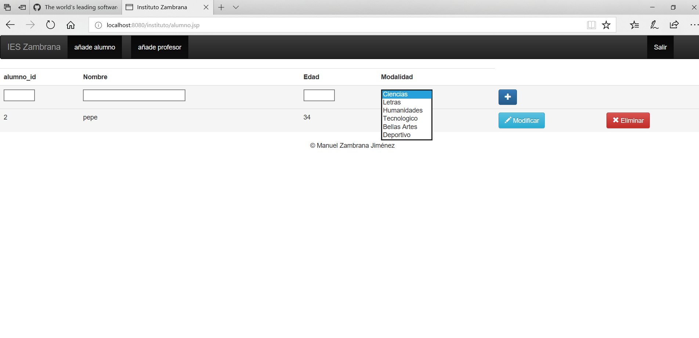
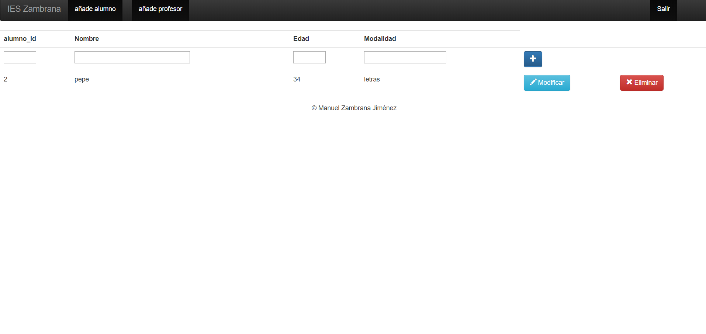
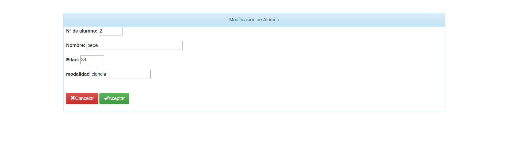
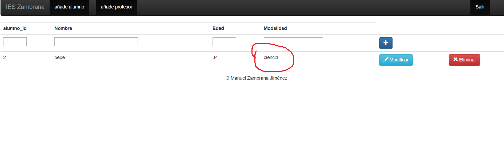

# CRUD_JSP 2.0

Este ejercicio consistirá en un CRUD sobre los datos de un instituto, donde tendremos tablas como: Alumnos, Profesores, asiganturas,material etc...

El inicio sesión del crud costa de un usuario y contraseña para poder entrar
(root,root usuario,usuario admin,admin)

Una vez dentro podremos ver un simple inicio con LoremIpsum para rellenar
Aquí podremos ver una barra de navegación también

En añade alumnos podremos entrar a una pestaña para poder añadir alumnos
y podemos elegir una modalidad con un arraylist

Eliminar (como el alumno con id 1)

modificar (como el alumno 2 donde cambio su modalidad ) y comprobamos que funciona 

Una vez modificado podremos volver a la pagina principal o a la lista de alumnos

Y aquí vemos el cambio de alumno

En el inicio podremos acceder al repositorio del CRUD clickeando en GitHub.

El funcionamiento de la tabla profesor es igual que la de alumnos donde podremos
editar profesores, añadir y borrar

